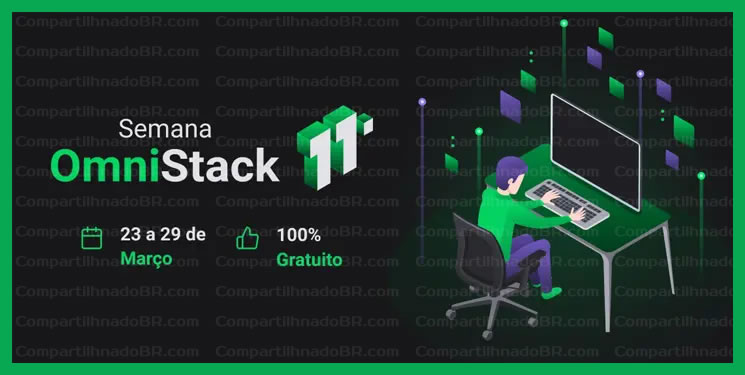

<h1 align="center">
    
</h1>
<h1 align="center">Semana Omnistack 11.0</h1>

## :Tecnologias

Esse projeto foi desenvolvido com as seguintes tecnologias:

- [Node.js](https://nodejs.org/en/)
- [React](https://reactjs.org)
- [React Native](https://facebook.github.io/react-native/)
- [Expo](https://expo.io/)

## 💻 Projeto

O DevRadar é um projeto que visa conectar desenvolvedores próximos a você que trabalham com as mesmas tecnologias.
